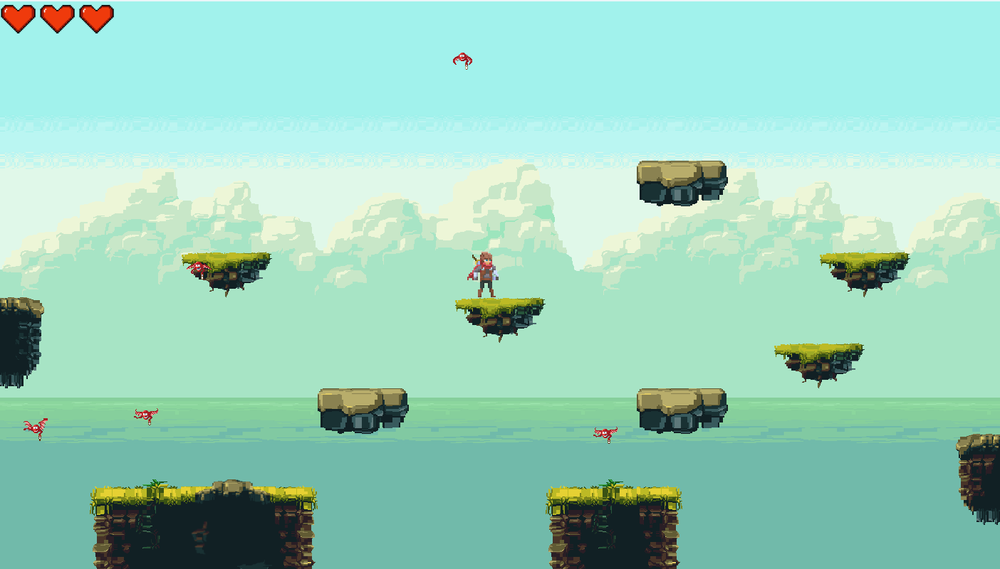

# Platform game
> This game was created for the purpose of completing the Object oriented programming course.

[](https://forthebadge.com)

<!--  -->


## Technologies

- [Python](https://www.python.org/) (v3.10.7) - Python language
- [Pygame](https://www.pygame.org/news) (v2.2.0) - Set of Python modules designed for writing video games

## Usage & development setup
> Prerequisites: install latest version of Python.
1. Clone/pull repository.
2. In project folder create Python virtual environment.
```sh
$ python -m venv .venv
```
3. Activate virtual environment.

- MacOS / Linux

```sh
$ source .venv/bin/activate
```

- Windows

```sh
$ .\.venv\Scripts\activate.bat
```
4. Install project's dependecies.

```sh
$ pip install -r requirements.txt
```

5. Run app.

```sh
$ python main.py
```

## License

All code is released under the [MIT](./LICENSE) License.